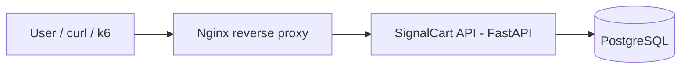
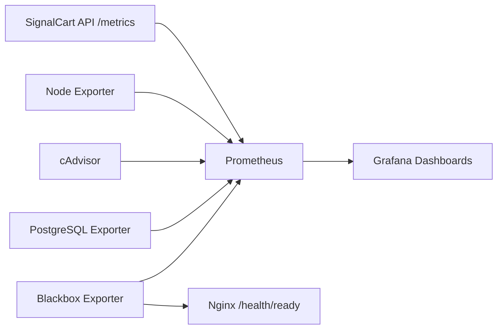

# Architecture

## Purpose

SignalCart Observability Lab is a local-first observability lab for practicing SRE operations around a small FastAPI checkout/cart API.

The architecture is intentionally focused: one API, one database, one reverse proxy, one metrics collection layer, one visualization layer, one container runtime, and one synthetic-ready HTTP entrypoint.

## Runtime Path

## Metrics Collection and Visualization Path

## Main Components

- **SignalCart API**: FastAPI service with health checks, business endpoints, metrics, and controlled lab simulation endpoints.
- **PostgreSQL**: relational database for products, orders, and checkout data.
- **Nginx**: HTTP entrypoint and reverse proxy.
- **Docker Compose**: local runtime for PostgreSQL, API, Nginx, Prometheus, Grafana, and exporters.
- **Prometheus**: metrics collection and query layer.
- **Grafana**: visualization layer.
- **Node Exporter**: host metrics.
- **cAdvisor**: container metrics.
- **PostgreSQL Exporter**: database metrics.
- **Blackbox Exporter**: synthetic probe metrics.

## Application Metrics Endpoint

SignalCart API exposes `GET /metrics` in Prometheus text format.

The API exposes HTTP request counters, request duration histograms, in-progress request gauge, product/order/checkout counters, database readiness gauge, and simulation state gauges.

## Runtime Services

- `nginx` on `http://127.0.0.1:8080`
- `api` internally on port `8000`
- `postgres` locally on port `5432`
- `prometheus` on `http://127.0.0.1:9090`
- `grafana` on `http://127.0.0.1:3000`
- `node-exporter`, `cadvisor`, `postgres-exporter`, and `blackbox-exporter` internally on the Compose network

## Prometheus Jobs

- `prometheus`
- `signalcart-api`
- `node-exporter`
- `cadvisor`
- `postgres-exporter`
- `blackbox-nginx`

The `blackbox-nginx` job probes the Nginx-exposed readiness endpoint from inside the Compose network.

## Grafana Visualization Layer

The Prometheus datasource is provisioned from `docker/grafana/provisioning/datasources/prometheus.yml`.

Dashboards are provisioned from `docker/grafana/provisioning/dashboards/dashboards.yml` and `dashboards/`.

Provisioned dashboards:

- SignalCart Overview
- API RED Metrics
- Infrastructure and Container Metrics
- PostgreSQL Metrics
- Synthetic Checks

## Health Model

`/health/live` confirms that the API process is alive. `/health/ready` confirms that required dependencies are usable by validating PostgreSQL with a lightweight database query.
