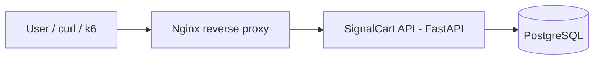
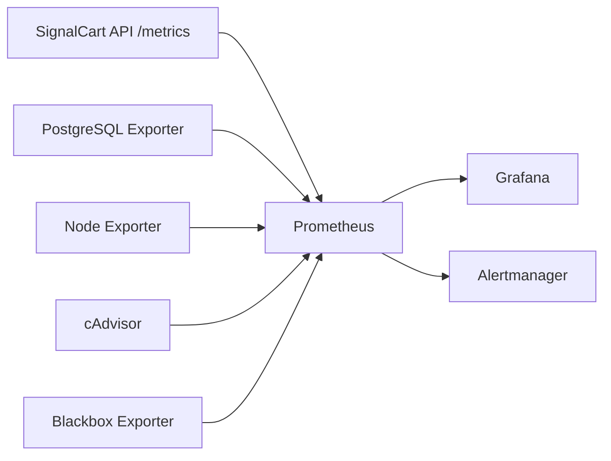

# Architecture

## Purpose

SignalCart Observability Lab is a local-first observability lab for practicing SRE operations around a small FastAPI checkout/cart API.

The architecture is intentionally focused:

- one API
- one database
- one reverse proxy
- one metrics backend
- one visualization layer
- one alert validation layer
- one synthetic monitoring path

This keeps the lab practical, reproducible, and centered on observability.

## Runtime Path



## Observability Path



## Main Components

### SignalCart API

FastAPI service that exposes health checks, business endpoints, metrics, and controlled lab simulation endpoints.

### PostgreSQL

Relational database used by the API for products, orders, and checkout-related data.

### Nginx

Reverse proxy that exposes the API through a single HTTP entrypoint.

### Prometheus

Metrics backend that scrapes the API and exporters.

### Grafana

Dashboard layer for API, infrastructure, PostgreSQL, and synthetic monitoring views.

### Alertmanager

Alert validation layer used during incident simulations.

## Exporters

- Node Exporter for host metrics
- cAdvisor for container metrics
- PostgreSQL Exporter for database metrics
- Blackbox Exporter for synthetic endpoint checks

## k6

Load testing tool used to generate traffic and validate behavior under controlled experiments.
## Database Persistence

SignalCart API stores products, orders, and order items in PostgreSQL.

SQLAlchemy provides the application data access layer.

Alembic manages database schema migrations.

The database schema is versioned through migration files under:

```text
migrations/
```

## Application Metrics Endpoint

SignalCart API exposes application metrics at:

```text
GET /metrics
```

The endpoint returns Prometheus-compatible text format.

The endpoint is designed to be scraped by Prometheus.

The API currently exposes:

- HTTP request counters
- HTTP request duration histogram
- in-progress request gauge
- product, order, and checkout counters
- database readiness gauge
- simulation state gauges
