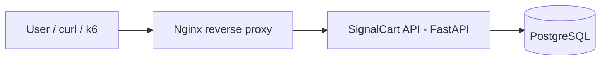
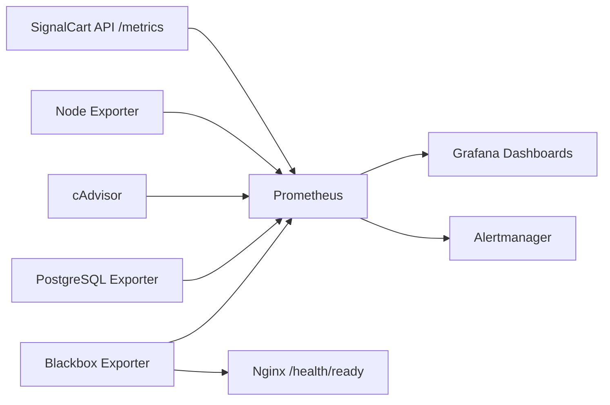

# Architecture

## Purpose

SignalCart Observability Lab is a local-first observability lab for practicing SRE operations around a small FastAPI checkout/cart API.

The architecture is focused on one API, one database, one reverse proxy, one metrics collection layer, one visualization layer, one alerting layer, one container runtime, and one synthetic-ready HTTP entrypoint.

## Runtime Path

## Metrics, Dashboards, and Alerts

## Main Components

- **SignalCart API**: FastAPI service exposing health checks, business endpoints, metrics, and controlled lab simulation endpoints.
- **PostgreSQL**: relational datastore for products, orders, and order items.
- **Nginx**: reverse proxy and user-facing HTTP entrypoint.
- **Docker Compose**: local runtime for the API, database, proxy, Prometheus, Grafana, Alertmanager, and exporters.
- **Prometheus**: metrics collection and alert evaluation layer.
- **Grafana**: visualization layer.
- **Alertmanager**: local alert grouping, deduplication, UI validation, and API validation.
- **Node Exporter**: host metrics.
- **cAdvisor**: container metrics.
- **PostgreSQL Exporter**: database metrics.
- **Blackbox Exporter**: synthetic HTTP probes against Nginx readiness.

## Database Persistence

SignalCart API stores products, orders, and order items in PostgreSQL. SQLAlchemy provides the data access layer. Alembic manages schema migrations under `migrations/`.

## Application Metrics Endpoint

SignalCart API exposes Prometheus-compatible metrics at `GET /metrics`.

The API exposes HTTP request counters, request duration histograms, in-progress request gauges, domain counters, database readiness gauge, and simulation state gauges.

## Container Runtime

Runtime services:

- `nginx`: `http://127.0.0.1:8080`
- `prometheus`: `http://127.0.0.1:9090`
- `grafana`: `http://127.0.0.1:3000`
- `alertmanager`: `http://127.0.0.1:9093`
- `postgres`: local database on `127.0.0.1:5432`
- `api`, `node-exporter`, `cadvisor`, `postgres-exporter`, and `blackbox-exporter`: internal Compose services

## Metrics Collection Jobs

Prometheus collects from:

- `prometheus`
- `signalcart-api`
- `node-exporter`
- `cadvisor`
- `postgres-exporter`
- `blackbox-nginx`

## Grafana Visualization Layer

The Prometheus datasource is provisioned from `docker/grafana/provisioning/datasources/prometheus.yml`.

Dashboards are provisioned from `docker/grafana/provisioning/dashboards/dashboards.yml` and `dashboards/`.

Dashboards:

- SignalCart Overview
- API RED Metrics
- Infrastructure and Container Metrics
- PostgreSQL Metrics
- Synthetic Checks

## Alerting Layer

Prometheus loads alert rules from `alerts/` and sends firing alerts to Alertmanager at `http://alertmanager:9093`.

Alertmanager is available locally at `http://127.0.0.1:9093`.

Alert rules cover API scrape availability, API error rate, API latency, database readiness, PostgreSQL availability, host saturation, container restart signals, and Nginx synthetic probe failure.

## Health Model

`/health/live` confirms that the API process is alive. `/health/ready` confirms that required dependencies are usable and validates PostgreSQL with a lightweight query.
