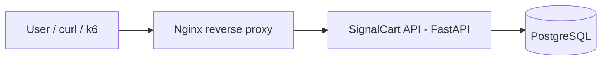
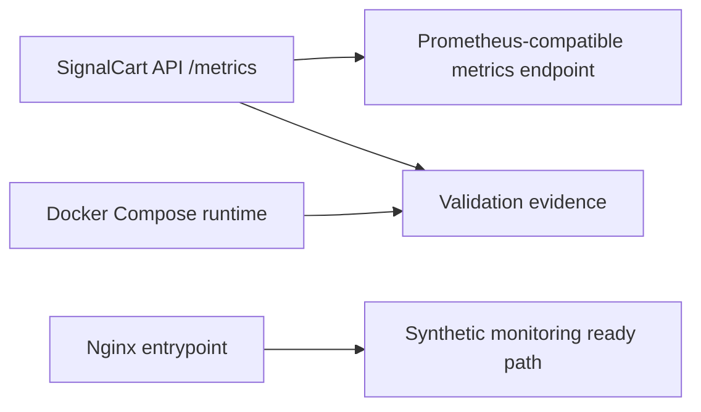
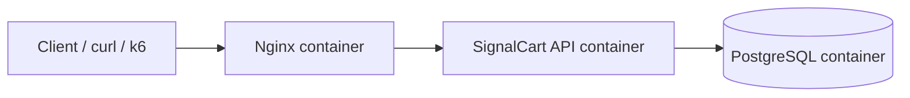

# Architecture

## Purpose

SignalCart Observability Lab is a local-first observability lab for practicing SRE operations around a small FastAPI checkout/cart API.

The architecture is intentionally focused:

- one API
- one database
- one reverse proxy
- one metrics endpoint
- one container runtime
- one synthetic-ready HTTP entrypoint

This keeps the lab practical, reproducible, and centered on observability.

## Runtime Path



## Observability Path



## Main Components

### SignalCart API

FastAPI service that exposes health checks, business endpoints, metrics, and controlled lab simulation endpoints.

### PostgreSQL

Relational database used by the API for products, orders, and checkout-related data.

### Nginx

Reverse proxy that exposes the API through a single HTTP entrypoint.

### Docker Compose

Local runtime used to run PostgreSQL, SignalCart API, and Nginx together.

### SQLAlchemy

Python data access layer used by the API.

### Alembic

Database migration tool used to version schema changes.

### pytest

Test runner used to validate application behavior and metrics.

### k6

Load testing tool used to generate traffic and validate behavior under controlled experiments.

## Database Persistence

SignalCart API stores products, orders, and order items in PostgreSQL.

SQLAlchemy provides the application data access layer.

Alembic manages database schema migrations.

The database schema is versioned through migration files under:

```text
migrations/
```

## Application Metrics Endpoint

SignalCart API exposes application metrics at:

```text
GET /metrics
```

The endpoint returns Prometheus-compatible text format.

The API exposes:

- HTTP request counters
- HTTP request duration histogram
- in-progress request gauge
- product, order, and checkout counters
- database readiness gauge
- simulation state gauges

## Container Runtime

SignalCart runs as a Docker Compose application with three runtime services:

- `nginx` exposes the HTTP entrypoint on `http://127.0.0.1:8080`
- `api` runs SignalCart API with FastAPI and Uvicorn
- `postgres` stores products, orders, and order items

Nginx forwards incoming HTTP requests to the API container over the internal Compose network.



The API exposes `/metrics`; the endpoint is reachable through Nginx and is ready for the observability workflow.

## Runtime Ports

| Component | Host Port | Container Port | Purpose |
|---|---:|---:|---|
| Nginx | 8080 | 80 | Public HTTP entrypoint |
| SignalCart API | internal | 8000 | FastAPI service |
| PostgreSQL | internal | 5432 | Relational database |

## Health Model

SignalCart API exposes two health endpoints:

- `/health/live` confirms that the API process is alive.
- `/health/ready` confirms that required dependencies are usable.

The readiness endpoint validates PostgreSQL with a lightweight database query.
